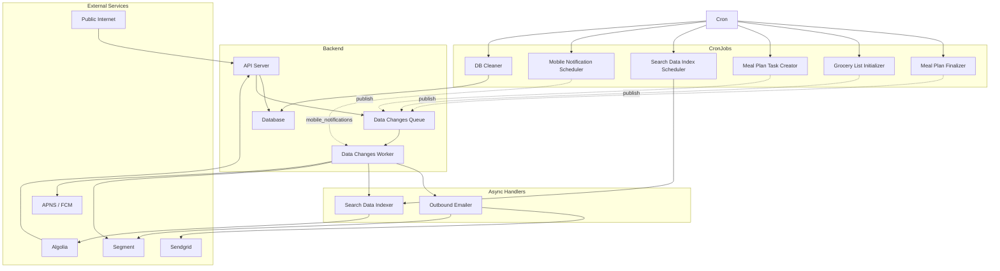

# Dinner Done Better API

[](https://github.com/dinnerdonebetter/dinnerdonebetter/actions/workflows/backend_deploy_dev.yaml) [](https://github.com/dinnerdonebetter/dinnerdonebetter/actions/workflows/backend_integration_tests.yaml) [](https://github.com/dinnerdonebetter/dinnerdonebetter/actions/workflows/backend_lint.yaml) [](https://github.com/dinnerdonebetter/dinnerdonebetter/actions/workflows/backend_unit_tests.yaml)

Go backend for Dinner Done Better — meal planning, recipes, grocery lists, and more. Exposes gRPC and HTTP APIs, backed by PostgreSQL, with workers for indexing, email, and meal plan lifecycle.

---

## Quick start

```bash
cd backend
make setup      # first-time: vendor, wire, configs, install tools
make dev        # start local dev server
```

→ **<http://localhost:8000>** (HTTP) · **localhost:8001** (gRPC)

---

## Prerequisites

| Category    | Tools                                                                                                                                                                                                                                                 |
|-------------|-------------------------------------------------------------------------------------------------------------------------------------------------------------------------------------------------------------------------------------------------------|
| **Core**    | [Go](https://golang.org/) 1.26, [Make](https://www.gnu.org/software/make/), [Docker](https://docs.docker.com/get-docker/) & [Docker Compose](https://docs.docker.com/compose/install/)                                                                |
| **Codegen** | [Wire](https://github.com/google/wire), [sqlc](https://sqlc.dev/), [gci](https://github.com/daixiang0/gci), [tagalign](https://github.com/4meepo/tagalign), [fieldalignment](https://pkg.go.dev/golang.org/x/tools/go/analysis/passes/fieldalignment) |
| **Infra**   | [Terraform](https://learn.hashicorp.com/tutorials/terraform/install-cli), [Cloud SQL Proxy](https://cloud.google.com/sql/docs/postgres/sql-proxy) (for prod DB access)                                                                                |

Install Go tools:

```bash
go install github.com/google/wire/cmd/wire@v0.7.0
go install golang.org/x/tools/go/analysis/passes/fieldalignment/cmd/fieldalignment@v0.37.0
go install github.com/4meepo/tagalign/cmd/tagalign@v1.4.3
go install github.com/daixiang0/gci@v0.13.5
```

`make setup` will ensure these are installed.

---

## Development

### First-time setup

```bash
make setup
```

Runs: `revendor`, `rewire`, `configs`, and ensures Wire, fieldalignment, tagalign, and gci are installed.

### Running locally

```bash
make dev
```

Starts the all-in-one local dev server (API, workers, in-memory queue, local Postgres via compose). Uses config from `deploy/environments/testing/config_files/integration-tests-config.json`.

### Before committing

```bash
make test lint integration_tests
```

### Common targets

| Target                   | Description                                 |
|--------------------------|---------------------------------------------|
| `make dev`               | Start local dev server                      |
| `make admin`             | Start admin webapp (requires dev server)    |
| `make consumer`          | Start consumer webapp (requires dev server) |
| `make test`              | Run unit tests                              |
| `make lint`              | Lint Go, SQL, containers, shell             |
| `make integration_tests` | Run integration tests (Postgres)            |
| `make format`            | Format Go and Terraform                     |
| `make build-api`         | Build API binary to `artifacts/api`         |
| `make proxy_db`          | Connect Cloud SQL Proxy to prod DB          |

---

## Documentation

| Doc                                                   | Description                               |
|-------------------------------------------------------|-------------------------------------------|
| [adding_a_new_domain.md](docs/adding_a_new_domain.md) | Checklist for adding new domains/entities |
| [configuration.md](docs/configuration.md)             | Config files and env var overrides        |
| [migrations.md](docs/migrations.md)                   | Database migrations                       |
| [payments.md](docs/payments.md)                       | Payments integration                      |
| [writing_go.md](docs/writing_go.md)                   | Go style and conventions                  |

---

## Infrastructure


```mermaid
flowchart TB
    subgraph External["External Services"]
        PublicInternet["Public Internet"]
        Sendgrid["Sendgrid"]
        Segment["Segment"]
        Algolia["Algolia"]
        APNS["APNS / FCM"]
    end

    subgraph Backend["Backend"]
        APIServer["API Server"]
        Database["Database"]
        DataChangesQueue["Data Changes Queue"]
        DataChangesWorker["Data Changes Worker"]
    end

    subgraph CronJobs["CronJobs"]
        MealPlanFinalizer["Meal Plan Finalizer"]
        MealPlanGroceryListInit["Grocery List Initializer"]
        MealPlanTaskCreator["Meal Plan Task Creator"]
        SearchDataIndexScheduler["Search Data Index Scheduler"]
        MobileNotificationScheduler["Mobile Notification Scheduler"]
        DBCleaner["DB Cleaner"]
    end

    subgraph AsyncHandlers["Async Handlers"]
        OutboundEmailer["Outbound Emailer"]
        SearchDataIndexer["Search Data Indexer"]
    end

    Cron["Cron"] --> MealPlanFinalizer
    Cron --> MealPlanGroceryListInit
    Cron --> MealPlanTaskCreator
    Cron --> SearchDataIndexScheduler
    Cron --> MobileNotificationScheduler
    Cron --> DBCleaner

    MealPlanFinalizer -.->|publish| DataChangesQueue
    MealPlanGroceryListInit -.->|publish| DataChangesQueue
    MealPlanTaskCreator -.->|publish| DataChangesQueue

    DataChangesQueue --> DataChangesWorker
    DataChangesWorker --> OutboundEmailer
    DataChangesWorker --> SearchDataIndexer
    DataChangesWorker --> Segment

    SearchDataIndexScheduler --> SearchDataIndexer
    MobileNotificationScheduler -.->|mobile_notifications| DataChangesWorker
    SearchDataIndexer --> Algolia
    OutboundEmailer --> Sendgrid
    OutboundEmailer --> Segment
    DataChangesWorker --> APNS

    DBCleaner --> Database
    APIServer --> Database
    APIServer --> DataChangesQueue
    Algolia --> APIServer
    PublicInternet --> APIServer
```
