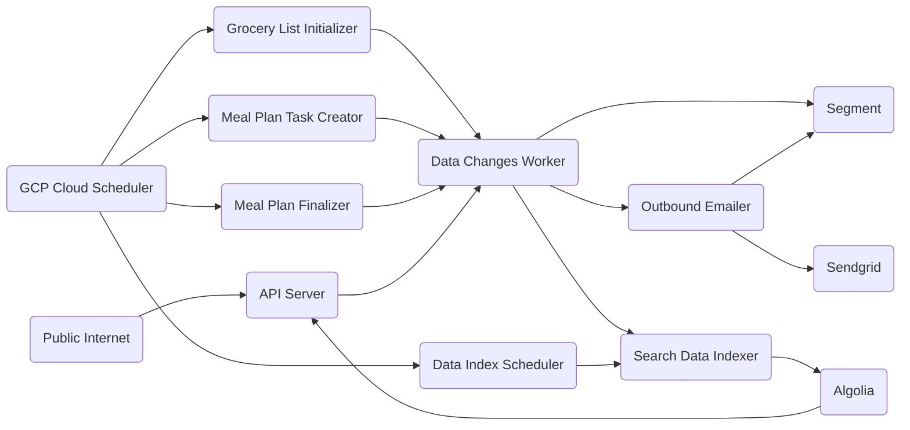

# Dinner Done Better API

## dev dependencies

The following tools are prerequisites for development work:

- [go](https://golang.org/) 1.22
- [docker](https://docs.docker.com/get-docker/) &&  [docker-compose](https://docs.docker.com/compose/install/)
- [wire](https://github.com/google/wire) for dependency management
- [make](https://www.gnu.org/software/make/) for task running
- [sqlc](https://sqlc.dev/) for generating database code
- [gci](https://www.github.com/daixiang0/gci) for sorting imports
- [tagalign](https://www.github.com/4meepo/tagalign) for aligning struct tags
- [terraform](https://learn.hashicorp.com/tutorials/terraform/install-cli) for deploying/formatting
- [cloud_sql_proxy](https://cloud.google.com/sql/docs/postgres/sql-proxy) for production database access
- [fieldalignment](https://pkg.go.dev/golang.org/x/tools/go/analysis/passes/fieldalignment) (`go install golang.org/x/tools/go/analysis/passes/fieldalignment/cmd/fieldalignment@latest`)

## dev setup

It's a good idea to run `make quicktest lint integration_tests` before commits.

## running the server

1. clone this repository
2. run `make dev`
3. [http://localhost:8000/](http://localhost:8000/)

## infrastructure

