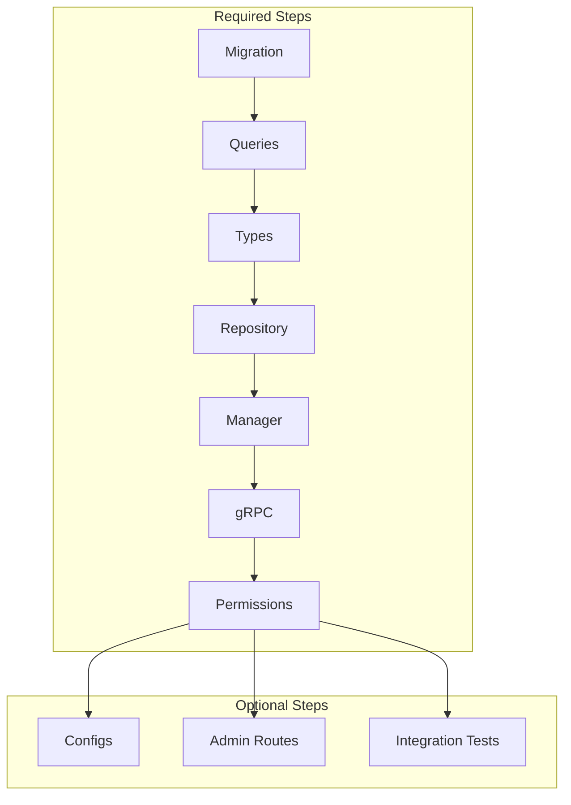

# Adding a New Domain

This document enumerates every step required to add a new domain (or new entity within an existing domain) to the system. It serves as the authoritative checklist for humans and AI agents, with file paths, patterns, and decision points made explicit.

**Reference checklist**: [`.github/pull_request_template.md`](.github/pull_request_template.md)

## When to Use This Doc

- **New business domain**: Adding a completely new area (e.g., invoicing, inventory) — follow the full path.
- **New entity within domain**: Adding a new table/entity to an existing domain (e.g., new `valid_*` in mealplanning) — follow the shorter path in [Section 11](#11-new-entity-within-existing-domain).

## High-Level Flow



---

## 1. Migration

### Location

- `backend/internal/repositories/postgres/migrations/migration_files/`
- Naming: `NNNNN_<domain_or_feature>.sql` (use next sequence number)

### Contents

- `CREATE TYPE` for enums
- `CREATE TABLE` for entities

### Patterns

- **Soft delete**: `archived_at` (nullable timestamp)
- **Timestamps**: `created_at`, `last_updated_at`
- **ID**: text ID stored as `TEXT`
- **Data ownership**: `belongs_to_user` vs. `belongs_to_account` — see [docs/identity.md](identity.md)

### Registration

Migrations are explicitly listed in `backend/internal/repositories/postgres/migrations/migrate.go`. Add a new entry:

```go
{Version: N, Description: "your domain tables", Script: fetchMigration("00019_your_domain")},
```

Migrations run on API server startup.

---

## 2. Queries (Full Workflow)

The query pipeline has two stages:

1. **Go codegen** (`cmd/tools/codegen/queries`) outputs `.sql` files
2. **sqlc** reads those `.sql` files and generates Go code

### 2a. Codegen That Produces SQL

**Location**: `backend/cmd/tools/codegen/queries/`

#### Add a query builder file

Create a file like `your_domain_entity_name.go` (e.g., `settings_service_settings.go`). Each file:

1. Defines `const tableName = "your_table_name"`
2. Calls `registerTableName(tableName)` in `init()`
3. Defines `var columns = []string{...}` (include `idColumn`, `createdAtColumn`, `lastUpdatedAtColumn`, `archivedAtColumn` from shared constants)
4. Implements `buildXxxQueries(database string) []*Query` returning a slice of `Query` structs

#### Query types

- `OneType`: Returns single row
- `ManyType`: Returns multiple rows (use with filtered_count, total_count for list endpoints)
- `ExecType`: Execute (e.g., INSERT)
- `ExecRowsType`: Execute and return affected row count (e.g., UPDATE)

#### Common queries

- `CreateXxx`: INSERT
- `GetXxx`: SELECT by ID
- `GetXxxs`: SELECT list with filtering (created_after, created_before, cursor, result_limit)
- `SearchForXxxs`: SELECT list with text search (e.g., `ILIKE` on name)
- `ArchiveXxx`: UPDATE `archived_at = NOW()`
- `CheckXxxExistence`: SELECT EXISTS

**Reference**: [backend/cmd/tools/codegen/queries/settings_service_settings.go](backend/cmd/tools/codegen/queries/settings_service_settings.go)

#### Register in main.go

Add an entry to the `queryOutput` map in `backend/cmd/tools/codegen/queries/main.go`:

```go
"internal/repositories/postgres/<domain>/sqlc_queries/<entity>.sql": build<Entity>Queries(databaseToUse),
```

### 2b. sqlc Configuration

**Location**: `backend/sqlc.yaml`

For a **new domain** (new package under `postgres/`), add a new engine block. Copy structure from an existing block (e.g., settings):

- `engine`: `postgresql`
- `schema`: `internal/repositories/postgres/migrations/migration_files`
- `queries`: path to `internal/repositories/postgres/<domain>/sqlc_queries`
- `gen.go.out`: `internal/repositories/postgres/<domain>/generated`
- Use same `rules`, `gen` options (emit_interface, omit_unused_structs, etc.)

For a **new entity within existing domain**: add a new `.sql` file under the domain's `sqlc_queries/` folder; no sqlc config change needed (same queries path).

### 2c. Commands

```bash
cd backend
make querier   # Runs: queries (codegen) + queries_lint + sqlc generate
```

---

## 3. Types (Domain Layer)

**Location**: `backend/internal/domain/<domain>/`

### Definitions

- Struct with `_ struct{}` for safety (per [writing_go.md](backend/docs/writing_go.md))
- JSON tags on exported fields
- Validation via `ozzo-validation` in `ValidateWithContext(ctx)`
- Input structs: `XxxCreationRequestInput`, `XxxUpdateRequestInput`, `XxxDatabaseCreationInput`

### Fakes

**Location**: `backend/internal/domain/<domain>/fakes/`

- `BuildFakeXxx()` functions returning realistic test data
- Used in integration tests and unit tests

Converters:

- **Domain <-> DB models**: Convert between domain structs and sqlc-generated models
- Place in `backend/internal/domain/<domain>/converters/` or inline in repository
- Pattern: `ConvertSqlcModelToDomain(m *generated.Model) *domain.Entity`

### Mocks

- Use `mockgen` for Repository and Manager interfaces
- `backend/internal/domain/<domain>/mock/repository.go`
- `backend/internal/domain/<domain>/manager/mock/manager.go`

**References**: [backend/internal/domain/settings/](backend/internal/domain/settings/), [backend/internal/domain/webhooks/](backend/internal/domain/webhooks/)

---

## 4. Data Layer: Repository and Manager

Preferred pattern: **Manager wraps Repository** (not Repository-only).

### 4a. Repository

**Location**: `backend/internal/repositories/postgres/<domain>/`

#### client.go (or entity-specific files)

- Struct holds: `generated.Querier`, `logger`, `tracer`, `database.Client`, `readDB`, `writeDB`
- Implement domain `Repository` interface
- Methods: call generated querier, convert sqlc models to domain, return
- **o11yName**: `"<domain>_db_client"` (e.g., `"webhook_db_client"`)

wire.go:

- `ProvideXxxRepository(logger, tracerProvider, ..., client) Repository`

#### Unit tests

- `client_test.go` or `<entity>_test.go` — test repo methods against test DB
- Use `internal/platform/database/postgres/testing` helpers

### 4b. Manager

**Location**: `backend/internal/domain/<domain>/manager/`

#### Interface (interface.go)

```go
type XxxDataManager interface {
    CreateXxx(ctx context.Context, ...) (*domain.Xxx, error)
    GetXxx(ctx context.Context, id, accountID string) (*domain.Xxx, error)
    GetXxxs(ctx context.Context, accountID string, filter *filtering.QueryFilter) (*filtering.QueryFilteredResult[domain.Xxx], error)
    ArchiveXxx(ctx context.Context, id, accountID string) error
    // ...
}
```

#### Implementation

- Wraps Repository
- Adds: validation, multi-step logic, event publishing, ID generation
- **o11yName**: `"<domain>_data_manager"` (e.g., `"webhook_data_manager"`)

wire.go:

- `ProvideXxxManager(...)` or `NewXxxDataManager(...)`

**Reference**: [backend/internal/domain/webhooks/manager/](backend/internal/domain/webhooks/manager/)

### 4c. Wire and Build

Add to `backend/internal/build/services/api/grpc/build.go`:

- `xxxrepo.XxxRepoProviders` (or equivalent)
- `xxxmanager.XxxManagerProviders` (or equivalent)

Each repo needs:

- Entry in `sqlc.yaml` (if new domain)
- `backend/internal/repositories/postgres/<domain>/wire.go` exporting providers

---

## 5. gRPC

### 5a. Protobuf

**Location**: `proto/<domain>/`

Typical split:

- `xxx_service.proto`: service definition and RPCs
- `xxx_messages.proto`: message definitions
- `xxx_service_types.proto`: shared types (if used)

Define:

- `service XxxService { rpc CreateXxx(...) returns (...); ... }`
- Request/response messages
- `option go_package = "github.com/dinnerdonebetter/backend/internal/grpc/generated/services/<domain>";`

**Generate**:

```bash
make proto   # From repo root: format_proto, proto_golang, proto_swift
```

Output: `backend/internal/grpc/generated/services/<domain>/*.pb.go`

### 5b. gRPC Service Implementation

**Location**: `backend/internal/services/<domain>/grpc/`

#### service.go

- Struct implementing generated `XxxServiceServer`
- Depends on Manager (not Repository directly)
- **o11yName**: `"<domain>_service"` (e.g., `"configuration_service"`)
- Method handlers: extract session from context, call Manager, convert domain -> proto, return (or handle gRPC status errors)

Converters:

- Domain types <-> proto types
- in `converters/` subpackage

wire.go:

- `NewService(logger, tracerProvider, xxxManager) XxxServiceServer`

### 5c. Registration

1. Add server to `BuildRegistrationFuncs` in [backend/internal/build/services/api/grpc/extras.go](backend/internal/build/services/api/grpc/extras.go):
   - Add parameter
   - Add `xxxsvc.RegisterXxxServiceServer(server, xxxService)` in registration func
2. Add service to wire.Build in [backend/internal/build/services/api/grpc/build.go](backend/internal/build/services/api/grpc/build.go)

---

## 6. Auth Interceptor and Permissions

### 6a. Permissions

**Location**: `backend/internal/authorization/`

Create or extend `*_permissions.go`:

```go
const (
    CreateXxxPermission Permission = "id_create.xxx"
    ReadXxxPermission   Permission = "id_read.xxx"
    ArchiveXxxPermission Permission = "id_archive.xxx"
    // ...
)
```

Pattern: `id_<action>.<resource>`. Add to any role/action registries if using RBAC (e.g., `permissible_action_ids.go`, `permission_set_checkers.go`).

**Reference**: [backend/internal/authorization/settings_permissions.go](backend/internal/authorization/settings_permissions.go)

### 6b. Method Permissions

**Location**: `backend/internal/services/<domain>/grpc/permissions.go`

```go
func ProvideMethodPermissions() XxxMethodPermissions {
    return XxxMethodPermissions{
        xxxsvc.XxxService_CreateXxx_FullMethodName: {authorization.CreateXxxPermission},
        xxxsvc.XxxService_GetXxx_FullMethodName:   {authorization.ReadXxxPermission},
        // ...
    }
}
```

Use generated `FullMethodName` constants from the gRPC generated code.

### 6c. Aggregate

In [backend/internal/build/services/api/grpc/extras.go](backend/internal/build/services/api/grpc/extras.go):

1. Add `xxxPermissions xxxgrpc.XxxMethodPermissions` parameter to `AggregateMethodPermissions`
2. Add merge loop: `for method, perms := range xxxPermissions { result[method] = perms }`

---

## 7. Observability Keys

Explicit `o11yName` constant in:

- Repository client: `"<domain>_db_client"`
- gRPC service: `"<domain>_service"`
- Manager: `"<domain>_data_manager"`

Used for:

- `tracing.NewTracer(tracing.EnsureTracerProvider(tracerProvider).Tracer(o11yName))`
- `logging.EnsureLogger(logger).WithName(o11yName)`

---

## 8. Configs (When Needed)

**Rarely needed.** Only add if the domain has runtime configuration (external URLs, feature flags, env-specific behavior).

If adding:

1. Add field to `ServicesConfig` in [backend/internal/config/services_config.go](backend/internal/config/services_config.go)
2. Add to `wire.FieldsOf(new(*ServicesConfig), "Xxx")` in [backend/internal/config/wire.go](backend/internal/config/wire.go)
3. Add values in codegen configs: `cmd/tools/codegen/configs/localdev.go`, `integrationtests.go`. For prod, update `deploy/environments/prod/kustomize/configs/*.json` as needed.

---

## 9. Integration Tests

**Location**: `backend/tests_integration/apiserver/`

**File**: `<domain>_<entity>_test.go` or `<domain>_<service>_test.go`

**Helpers** (from `init.go`):

- `createUserAndClientForTest(t)` — returns user and authenticated gRPC client
- `buildUnauthenticatedGRPCClientForTest(t)` — unauthenticated client

**Test cases**:

- Happy path (create, list, get, update, archive)
- Requires auth (call without token → error)
- Invalid input (validation failure → error)
- Permission denied (non-admin or wrong account → error), if applicable

**Reference**: [backend/tests_integration/apiserver/identity_accounts_test.go](backend/tests_integration/apiserver/identity_accounts_test.go)

---

## 10. Admin Web App Routes (When Applicable)

**Case-by-case.** API-only domains (e.g., internal ops, data privacy) may skip. Add when admins need CRUD (settings, valid_*, waitlists, issuereports).

**Location**: [backend/cmd/services/admin/routes.go](backend/cmd/services/admin/routes.go)

**Pattern**:

- List: `r.Get("/entities", ghttp.Adapt(s.EntitiesList))`
- Edit: `r.Get("/entities/{id}", ghttp.Adapt(s.EntityPage))`
- Create: `r.Get("/entities/new", ...)`, `r.Post("/api/entities", ...)`
- Search API: `r.Get("/api/entities/search", ...)`

**Handlers**: Implement in `cmd/services/admin/` — HTTP handlers that call gRPC or repository.

**Reference**: Settings, valid_ingredients, waitlists in routes.go

---

## 11. New Entity Within Existing Domain

Shorter path — reuse:

- Existing domain package
- Existing Repository package and sqlc block
- Existing protobuf service

**Add**:

1. Migration (new table)
2. Codegen query builder file + entry in codegen `main.go`
3. New `sqlc_queries/<entity>.sql` (generated by codegen)
4. Repository methods
5. Manager methods (if using Manager)
6. New RPCs in existing proto service
7. gRPC handlers
8. Permissions for new RPCs
9. Optionally: admin routes, integration tests

**Do not add**:

- New domain package
- New service package
- New sqlc engine block
- New wire blocks for service/repo (extend existing)

---

## 12. Quick Reference: File Checklist

| PR Checklist Item        | Files / Paths                                                                                                         |
|--------------------------|-----------------------------------------------------------------------------------------------------------------------|
| Migration                | `backend/internal/repositories/postgres/migrations/migration_files/NNNNN_name.sql`; register in `migrate.go`          |
| Queries                  | `cmd/tools/codegen/queries/<domain>_<entity>.go`; `main.go`; `sqlc_queries/<entity>.sql`; `sqlc.yaml` (if new domain) |
| Observability keys       | `o11yName` in repo client, gRPC service, manager                                                                      |
| Types - Definitions      | `backend/internal/domain/<domain>/*.go`                                                                               |
| Types - Fakes            | `backend/internal/domain/<domain>/fakes/`                                                                             |
| Types - Converters       | `backend/internal/domain/<domain>/converters/` or inline                                                              |
| Types - Mocks            | `backend/internal/domain/<domain>/mock/`, `manager/mock/`                                                             |
| Data Manager - Storage   | `backend/internal/repositories/postgres/<domain>/*.go`                                                                |
| Data Manager - Interface | `backend/internal/domain/<domain>/manager/interface.go`                                                               |
| Data Manager - Impl      | `backend/internal/domain/<domain>/manager/*.go`                                                                       |
| Data Manager - Wire      | `manager/wire.go`; `build.go`                                                                                         |
| gRPC - Proto             | `proto/<domain>/*.proto`                                                                                              |
| gRPC - Service           | `backend/internal/services/<domain>/grpc/service.go`                                                                  |
| gRPC - Converters        | `services/<domain>/grpc/converters/` or inline                                                                        |
| gRPC - Registration      | `build/services/api/grpc/extras.go`, `build.go`                                                                       |
| Auth interceptor         | `authorization/*_permissions.go`; `services/<domain>/grpc/permissions.go`; `extras.go` AggregateMethodPermissions     |
| Configs                  | `config/services_config.go`, `wire.go`, `codegen/configs/*.go` (if needed)                                            |
| Integration tests        | `tests_integration/apiserver/<domain>_<entity>_test.go`                                                               |
| Admin - List view        | `cmd/services/admin/routes.go`; handler in `cmd/services/admin/`                                                      |
| Admin - Edit view        | Same                                                                                                                  |
