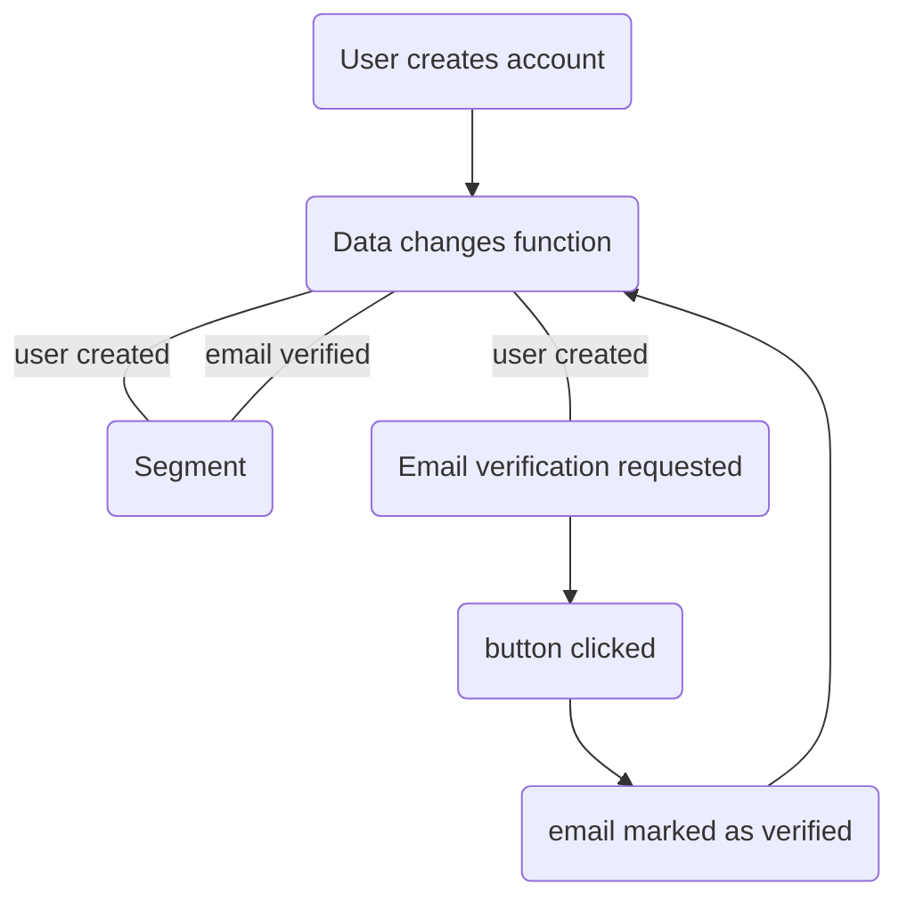

# How users email addresses get verified

### Basic process

```mermaid
flowchart TD
    UserCreated(User creates account)
    UserCreated(User creates account) --> DataChangesChannel(Data changes function)
    DataChangesChannel(Data changes function)---|user created|Segment(Segment)
    DataChangesChannel(Data changes function)---|user created|EmailVerificationRequested(Email verification requested)
    DataChangesChannel(Data changes function)---|email verified|Segment(Segment)
    EmailVerificationRequested(Email verification requested) --> EmailVerifiedClick(button clicked)
    EmailVerifiedClick(button clicked) --> UserEmailVerified(email marked as verified)
    UserEmailVerified(email marked as verified) --> DataChangesChannel(Data changes function)
```
