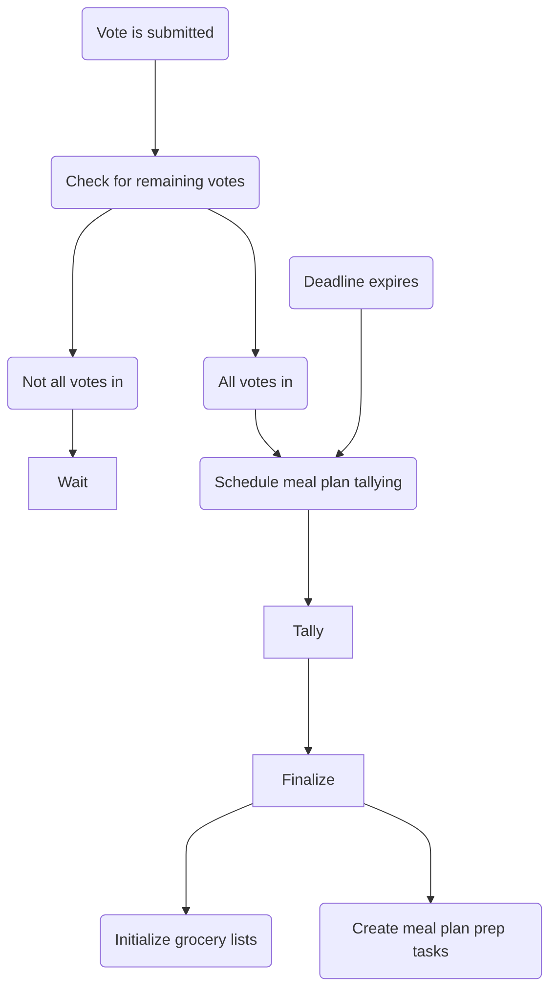

# Meal planning overview

### some basic lingo

- a recipe: one component of a meal
- a meal: one or more recipes
- a meal plan: a set of meals for a given time period

### How is meal planning meant to work today

- user submits a meal plan
- if one of the following happens:
  - every member of the household votes for every option in the meal plan
  - the voting period for the meal plan expires
- the meal plan is finalized by the meal plan finalizer
- once the meal plan is finalized, the meal plan task creator (for creating prep tasks) and the grocery list initializer (for creating a grocery list) can run on the meal plan in question

These all operate via cron at the moment, meaning they run all the time, even when there are no meal plans.

### How does meal planning actually work today

TODO: validate the above stuff

### How should meal planning work in the future?

- meal plan finalizer is the only thing that runs on a cron, it triggers the other two things to run on the back of the meal plan it finalizes
- etc...

