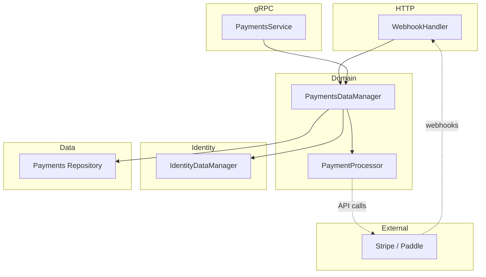

# Payments Domain

This document describes how the payments domain works, its architecture, and how to wire everything up for local development and production.

## Overview

The payments domain handles:

- **Products** — Sellable items (one-time or recurring)
- **Subscriptions** — Account subscriptions linked to products and external providers (Stripe, Paddle, etc.)
- **Purchases** — One-time purchases
- **Payment transactions** — Records of payments for auditing and reporting

It integrates with the **identity** domain: accounts store `billing_status`, `payment_processor_customer_id`, and `subscription_plan_id`, which are updated when webhooks arrive from payment providers.

---

## Architecture



### Components

| Component               | Location                                   | Role                                                                  |
|-------------------------|--------------------------------------------|-----------------------------------------------------------------------|
| **PaymentsDataManager** | `internal/domain/payments/manager/`        | Business logic: products, subscriptions, checkout, webhook processing |
| **PaymentProcessor**    | `internal/domain/payments/processor.go`    | Interface for provider integrations (Stripe, Paddle, etc.)            |
| **Repository**          | `internal/repositories/postgres/payments/` | Persistence for products, subscriptions, purchases, transactions      |
| **gRPC Service**        | `internal/services/payments/grpc/`         | API for CreateProduct, GetSubscription, etc.                          |
| **WebhookHandler**      | `internal/services/payments/http/`         | HTTP POST endpoint for provider webhooks                              |
| **IdentityDataManager** | `internal/domain/identity/manager/`        | Updates account billing fields when subscriptions change              |

---

## Data Model

### Migration: `00011_payments.sql`

- **products** — id, name, description, kind (recurring/one_time), amount_cents, currency, external_product_id
- **subscriptions** — id, belongs_to_account, product_id, external_subscription_id, status, current_period_start/end
- **purchases** — id, belongs_to_account, product_id, amount_cents, completed_at, external_transaction_id
- **payment_transactions** — id, belongs_to_account, subscription_id, purchase_id, external_transaction_id, amount_cents, status

### Identity Integration

The `accounts` table (identity domain) stores:

- `billing_status` — paid, trial, unpaid
- `payment_processor_customer_id` — external customer ID (e.g., Stripe `cus_xxx`)
- `subscription_plan_id` — product ID of the current plan
- `last_payment_provider_sync_occurred_at` — when we last synced with the provider

These are updated by `UpdateAccountBillingFields` when webhooks arrive.

---

## PaymentProcessor Interface

All provider-specific logic lives behind `payments.PaymentProcessor`:

```go
type PaymentProcessor interface {
    CreateCustomer(ctx context.Context, accountID, email, name string) (externalCustomerID string, err error)
    CreateCheckoutSession(ctx context.Context, params CheckoutSessionParams) (sessionURL, sessionID string, err error)
    GetSubscriptionStatus(ctx context.Context, externalSubscriptionID string) (status string, err error)
    CancelSubscription(ctx context.Context, externalSubscriptionID string) error
    VerifyWebhookSignature(ctx context.Context, payload []byte, signature string, accountID string) bool
    ParseWebhookEvent(ctx context.Context, payload []byte) (eventType string, accountID string, subscriptionID string, err error)
}
```

### Implementations

| Implementation            | Location                                        | Use case                                                               |
|---------------------------|-------------------------------------------------|------------------------------------------------------------------------|
| **StubPaymentProcessor**  | `internal/services/payments/adapters/stub.go`   | Local dev, integration tests. No external calls, accepts all webhooks. |
| **Stripe** (to implement) | `internal/services/payments/adapters/stripe.go` | Production Stripe integration                                          |

---

## Webhook Flow

1. **Endpoint**: `POST /api/payments/webhooks/{provider}`  
   - `{provider}` is currently unused but allows future routing (e.g. `stripe`, `paddle`).

2. **Header**: Signature in `Stripe-Signature` (configurable via `WebhookSignatureHeader`).

3. **Processing**:
   - `WebhookHandler.Handle` reads body and signature.
   - Calls `PaymentsDataManager.ProcessWebhookEvent(ctx, payload, signature, accountID)`.
   - Manager:
     - Verifies signature via `processor.VerifyWebhookSignature`.
     - Parses event via `processor.ParseWebhookEvent`.
     - Handles `subscription.updated`, `subscription.created`, `subscription.deleted`, etc.
   - Updates subscription status in DB and account billing fields via `IdentityDataManager.UpdateAccountBillingFields`.

4. **Event types supported**:
   - `subscription.updated`, `subscription.created`, `customer.subscription.updated` → sync status, update account billing.
   - `subscription.deleted`, `customer.subscription.deleted` → mark cancelled, set account to unpaid.

---

## Wire and Build

### HTTP API Server

**`internal/build/services/api/http/build.go`**:

```go
paymentsrepo.PaymentsRepoProviders
paymentsmanager.PaymentsManagerProviders
paymentsadapters.PaymentsAdapterProviders   # Binds StubPaymentProcessor
paymentshttp.PaymentsHTTPProviders
```

**`internal/build/services/api/http/http_routes.go`**:

- `ProvideAPIRouter` receives `*paymentswebhook.WebhookHandler`.
- Route: `router.Route("/api/payments/webhooks", ...)` with `Post("/{provider}", webhookHandler.Handle)`.

### gRPC API Server

**`internal/build/services/api/grpc/build.go`**:

- `paymentsrepo.PaymentsRepoProviders`
- `paymentsmanager.PaymentsManagerProviders`
- `paymentsadapters.PaymentsAdapterProviders`
- `paymentsService` registered in `extras.go`.

---

## Going Live: Swapping Stub for Stripe

To use a real provider (e.g., Stripe):

### 1. Implement StripePaymentProcessor

Create `internal/services/payments/adapters/stripe.go` implementing `payments.PaymentProcessor`:

- `CreateCustomer` → Stripe Customers API
- `CreateCheckoutSession` → Stripe Checkout Sessions API
- `GetSubscriptionStatus` → Stripe Subscriptions API
- `CancelSubscription` → Stripe Subscriptions API
- `VerifyWebhookSignature` → `stripe/webhook.ConstructEvent` with webhook secret
- `ParseWebhookEvent` → Parse Stripe event JSON, return event type, account ID, subscription ID

### 2. Config

Add payments config (e.g., to `ServicesConfig`):

- `StripeAPIKey` — secret key
- `StripeWebhookSecret` — webhook signing secret (per endpoint)
- Optionally `StripePublishableKey` for client-side

Wire these via `wire.FieldsOf` and environment or codegen configs.

### 3. Swap Wire Binding

In `internal/services/payments/adapters/wire.go`:

```go
// Instead of:
var PaymentsAdapterProviders = wire.NewSet(
    NewStubPaymentProcessor,
    wire.Bind(new(payments.PaymentProcessor), new(*StubPaymentProcessor)),
)

// Use (for production):
var PaymentsAdapterProviders = wire.NewSet(
    NewStripePaymentProcessor,  // takes config, logger, tracer
    wire.Bind(new(payments.PaymentProcessor), new(*StripePaymentProcessor)),
)
```

Use build tags or env-specific wire sets if you want to keep stub for local dev and Stripe for prod.

### 4. Webhook URL

Configure your provider to send webhooks to:

```text
https://<your-api-host>/api/payments/webhooks/stripe
```

Use the same webhook secret in provider dashboard and `StripeWebhookSecret` config.

### 5. Products in Stripe

- Create products/prices in Stripe.
- Store `external_product_id` when creating products in our system (admin CRUD or bootstrap).

---

## Admin CRUD

**Routes** (`cmd/services/admin/routes.go`):

- Products: `/products`, `/products/new`, `/products/{id}`, `/api/products`, `/api/products/search`
- Subscriptions: `/subscriptions`, `/subscriptions/new`, `/subscriptions/{id}`, `/api/subscriptions`, `/api/subscriptions/search`

**Handlers**: `payments_products_handlers.go`, `payments_subscriptions_handlers.go`

Admin uses gRPC or repository directly to list/create/edit products and subscriptions.

---

## Permissions

**`internal/authorization/payments_permissions.go`**:

- Products: `create.products`, `read.products`, `update.products`, `archive.products`
- Checkout: `create.checkout_sessions`
- Subscriptions: `create.subscriptions`, `read.subscriptions`, `update.subscriptions`, `archive.subscriptions`, `cancel.subscriptions`
- Purchases / history: `read.purchases`, `read.payment_history`

**`internal/services/payments/grpc/permissions.go`** maps gRPC methods to these permissions. The auth interceptor enforces them.

---

## Integration Tests

**`testing/integration/apiserver/payments_test.go`**:

- `createProductForTest`, `createSubscriptionForTest` helpers
- Tests for CreateProduct, GetProduct, CreateSubscription, GetSubscription, etc.
- Uses `StubPaymentProcessor` (no external calls)

---

## Quick Reference: File Locations

| Purpose             | Path                                                    |
|---------------------|---------------------------------------------------------|
| Processor interface | `internal/domain/payments/processor.go`                 |
| Manager             | `internal/domain/payments/manager/`                     |
| Repository          | `internal/repositories/postgres/payments/`              |
| Stub adapter        | `internal/services/payments/adapters/stub.go`           |
| Adapter wire        | `internal/services/payments/adapters/wire.go`           |
| Webhook HTTP        | `internal/services/payments/http/`                      |
| gRPC service        | `internal/services/payments/grpc/`                      |
| Migration           | `migrations/migration_files/00011_payments.sql`         |
| Admin products      | `cmd/services/admin/payments_products_handlers.go`      |
| Admin subscriptions | `cmd/services/admin/payments_subscriptions_handlers.go` |
| Integration tests   | `testing/integration/apiserver/payments_test.go`        |

---

## Related Documents

- [Adding a New Domain](adding_a_new_domain.md) — General checklist for new domains
- [Migrations](migrations.md) — Migration workflow
