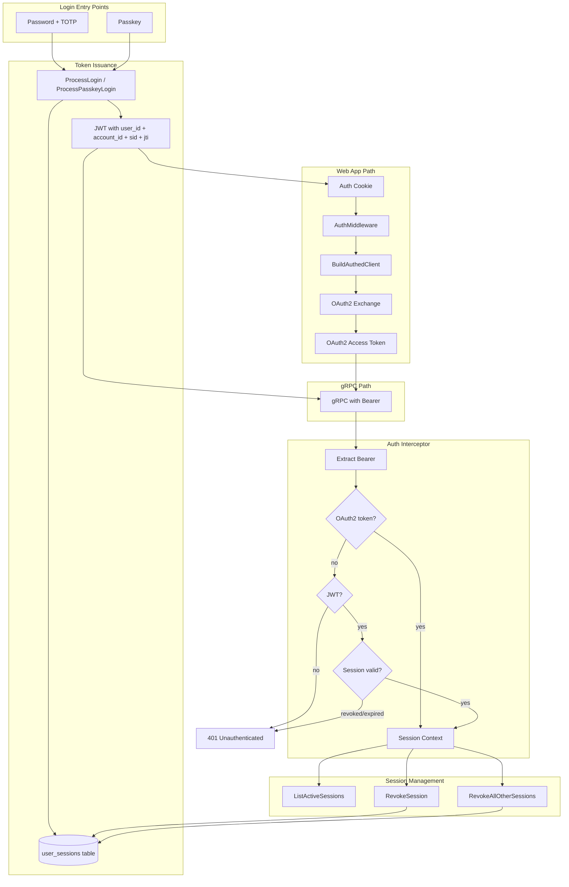

# Authentication Flow

This document describes how authentication works across the Dinner Done Better application. The system supports multiple auth methods, multiple client types, and a layered token model. For identity concepts (users, accounts, memberships), see [identity.md](identity.md).

## Overview

Authentication in this app is **convoluted by design**: there are several ways to log in, several token types, and the same token can flow through different paths depending on the client. The main sources of complexity:

1. **Multiple auth methods**: Password+TOTP and Passkey (WebAuthn)
2. **Two token systems**: JWT (from `LoginForToken`) and OAuth2 (stored in DB, used for gRPC)
3. **Multiple client types**: Consumer web app, Admin web app, mobile apps, API clients, integration tests
4. **Different paths for different clients**: Web apps use cookies + OAuth2 exchange; some clients send JWT directly

## Token Types

### JWT (from LoginForToken / ProcessLogin / ProcessPasskeyLogin)

- **Issued by**: `internal/authentication/manager.go` via `ProcessLogin`, `ProcessPasskeyLogin`, or `ExchangeTokenForUser`
- **Format**: JWT (or PASETO, configurable) with claims: `sub` (user ID), `account_id` (optional), `sid` (session ID), `jti` (unique token ID), `exp`, `aud`, `iss`
- **Lifetime**: Configurable (e.g. 5–10 min access, 72h refresh)
- **Used for**:
  - Stored in web app auth cookie
  - Input to OAuth2 authorization flow (Bearer token proves user identity)
  - Direct Bearer token for gRPC when using `WithBearerTokenCredentials` (e.g. localdev, tests)

**Implementation**: [`internal/authentication/tokens/jwt/jwt.go`](backend/internal/authentication/tokens/jwt/jwt.go)

### OAuth2 Access Token

- **Issued by**: OAuth2 server at `/oauth2/authorize` + `/oauth2/token`
- **Format**: Opaque string stored in `oauth2_client_tokens` table
- **Lifetime**: 24h access, 72h refresh
- **Used for**: gRPC `Authorization: Bearer <token>` when clients use the full OAuth2 flow

**Implementation**: [`internal/services/auth/handlers/authentication/oauth2.go`](backend/internal/services/auth/handlers/authentication/oauth2.go), [`oauth2_token_store.go`](backend/internal/services/auth/handlers/authentication/oauth2_token_store.go)

## Auth Methods

### 1. Password + TOTP (LoginForToken / AdminLoginForToken)

**Flow**:

1. Client calls gRPC `LoginForToken` (or `AdminLoginForToken` for admin-only) with username, password, and optionally TOTP.
2. `ProcessLogin` validates credentials via `Authenticator.CredentialsAreValid` (password + TOTP if 2FA verified).
3. Manager creates a server-side session record in the `user_sessions` table with device metadata (IP, User-Agent).
4. Manager issues JWT with `IssueToken` (user ID + account ID + session ID + JTI).
5. Client receives `TokenResponse` with `AccessToken` and `RefreshToken`.

**Entry points**:

- **Consumer web app**: `POST /login/submit` → `LoginForToken` → JWT stored in cookie
- **Admin web app**: `POST /login/submit` → `AdminLoginForToken` → JWT stored in cookie
- **gRPC clients**: Call `LoginForToken` directly, use token as Bearer or exchange for OAuth2

**Implementation**: [`internal/authentication/manager.go`](backend/internal/authentication/manager.go), [`internal/services/auth/grpc/auth.go`](backend/internal/services/auth/grpc/auth.go)

### 2. Passkey (WebAuthn)

**Flow**:

1. Client calls `BeginPasskeyAuthentication` (unauthenticated) with optional username.
2. Server returns `PublicKeyCredentialRequestOptions` and challenge; challenge stored in session.
3. User completes passkey assertion in browser.
4. Client calls `FinishPasskeyAuthentication` with assertion response and challenge.
5. WebAuthn service validates assertion, returns user ID.
6. `ProcessPasskeyLogin` creates a session record and issues JWT (same as password login).
7. Client stores JWT in cookie (web app) or uses it directly.

**Entry points**:

- **Consumer web app**: `POST /auth/passkey/authentication/options`, `POST /auth/passkey/authentication/verify`
- **Admin web app**: Same routes
- **gRPC**: `BeginPasskeyAuthentication`, `FinishPasskeyAuthentication`

**Implementation**: [`internal/authentication/webauthn/service.go`](backend/internal/authentication/webauthn/service.go), [`internal/services/auth/handlers/passkey/handlers.go`](backend/internal/services/auth/handlers/passkey/handlers.go)

## Web App Auth Flow (Consumer / Admin)

The consumer and admin frontends use the same pattern:

1. **Login**: User submits credentials (password or passkey) → `LoginForToken` or passkey handlers → JWT returned.
2. **Cookie**: JWT is encoded and stored in a signed cookie (`AuthPayload{AccessToken}`).
3. **Per-request**: `AuthMiddleware` reads cookie, decodes JWT, calls `BuildAuthedClient(ctx, config, accessToken, developingLocally)`.
4. **Client build**:
   - **Production**: `WithOAuth2Credentials` — uses JWT as Bearer to hit `/oauth2/authorize`, gets code, exchanges for OAuth2 token, uses OAuth2 token for gRPC.
   - **Local dev**: `BuildInsecureOAuthedGRPCClient` — same OAuth2 flow but over HTTP.
5. **gRPC calls**: Authenticated client sends OAuth2 access token (or JWT in some paths) as `Authorization: Bearer <token>`.

**Implementation**: [`internal/platform/webappauth/middleware.go`](backend/internal/platform/webappauth/middleware.go), [`internal/platform/webappauth/client_builder.go`](backend/internal/platform/webappauth/client_builder.go)

## gRPC Auth Interceptor

Every gRPC request (except unauthenticated routes) goes through `AuthInterceptor`:

1. **Extract token**: Read `Authorization: Bearer <token>` from metadata.
2. **Resolve session** (in order):
   - **OAuth2 first**: `oauth2ClientManager.LoadAccessToken(ctx, accessToken)` — if token is an OAuth2 access token, load from DB and get `user_id`.
   - **JWT fallback**: `tokenIssuer.ParseUserIDAndAccountIDFromToken(ctx, accessToken)` — if OAuth2 fails, treat as JWT.
3. **Validate session** (JWT path only): If the token has a `sid` claim, extract the `jti` and look up the session in `user_sessions`. If the session has been revoked or expired, return 401. Tokens without `sid` (pre-session-management) skip this check. Asynchronously updates `last_active_at` on the session.
4. **Build session context**: `identityDataManager.BuildSessionContextDataForUser(ctx, userID, accountID)`. The session ID is attached to `ContextData.SessionID`.
5. **Zuck mode** (optional): If `X-Zuck-Mode-User` header present and user can impersonate, override session with that user/account.
6. **Permissions**: Check method’s required permissions against session; deny if missing.
7. **Inject context**: Store `sessions.ContextData` in request context for handlers.

**Unauthenticated routes** (skip interceptor):

- `LoginForToken`, `AdminLoginForToken`
- `BeginPasskeyAuthentication`, `FinishPasskeyAuthentication`
- `CreateUser`, `VerifyTOTPSecret`
- `RequestPasswordResetToken`, `RedeemPasswordResetToken`
- `VerifyEmailAddress`

**Implementation**: [`internal/services/auth/grpc/interceptors/authn_interceptor.go`](backend/internal/services/auth/grpc/interceptors/authn_interceptor.go)

## OAuth2 Flow (for gRPC clients)

Clients that use OAuth2 (e.g. web app via `WithOAuth2Credentials`) follow this flow:

1. Client has a JWT (from `LoginForToken` or equivalent).
2. Client calls `GET /oauth2/authorize?client_id=X&state=Y&...` with `Authorization: Bearer <JWT>`.
3. `UserAuthorizationHandler` parses JWT, extracts `sub` (user ID), returns it to OAuth2 server.
4. OAuth2 server issues authorization code, redirects to `redirect_uri?code=Z`.
5. Client (with `CheckRedirect = ErrUseLastResponse`) reads `code` from `Location` header.
6. Client calls `POST /oauth2/token` with `code`, `client_id`, `client_secret` → receives OAuth2 access + refresh tokens.
7. Client uses OAuth2 access token for gRPC `Authorization: Bearer <oauth2_access_token>`.

**Endpoints** (API server):

- `GET /oauth2/authorize` — authorization
- `POST /oauth2/token` — token exchange
- `POST /oauth2/revoke` — token revocation

## Session Context

After auth, handlers receive `sessions.ContextData` in the request context. It contains:

- `Requester`: User ID, username, email, account status, service role
- `ActiveAccountID`: Account for this request
- `AccountPermissions`: Map of account ID → role checker
- `SessionID`: The server-side session ID (from the `sid` claim; empty for OAuth2 tokens or pre-session JWTs)

**Implementation**: [`internal/authentication/sessions/session_context.go`](backend/internal/authentication/sessions/session_context.go)

## Session Management

Users can view and manage their active login sessions. Each login (password, passkey) creates a record in the `user_sessions` table that tracks:

- **Device metadata**: Client IP, User-Agent, friendly device name (derived from User-Agent)
- **Login method**: `password` or `passkey`
- **Activity**: `created_at`, `last_active_at` (updated asynchronously on each request), `expires_at`
- **Token linkage**: `session_token_id` (access token JTI) and `refresh_token_id` (refresh token JTI), rotated on each token refresh

### Token Refresh and Session Continuity

When a client calls `ExchangeToken` with a refresh token, the system:

1. Extracts the `jti` and `sid` from the refresh token.
2. Looks up the session by refresh token JTI — rejects if revoked.
3. Issues new access + refresh tokens with the same `sid` but new JTIs.
4. Updates the session record with the new JTIs and expiration.

This means the session ID is stable across token refreshes, while individual tokens rotate.

### gRPC Endpoints

- **`ListActiveSessions`**: Returns all active (non-revoked, non-expired) sessions for the current user with pagination. Each session includes an `is_current` flag.
- **`RevokeSession`**: Revokes a specific session by ID. The revoked session's tokens are rejected on the next request.
- **`RevokeAllOtherSessions`**: Revokes all sessions except the one making the request.

### Backward Compatibility

Tokens issued before session management (without a `sid` claim) continue to work — the interceptor skips session validation for these tokens. As old tokens expire, all active tokens will have session tracking.

**Implementation**: [`internal/domain/auth/user_session.go`](backend/internal/domain/auth/user_session.go), [`internal/repositories/postgres/auth/user_sessions.go`](backend/internal/repositories/postgres/auth/user_sessions.go), [`internal/services/auth/grpc/auth.go`](backend/internal/services/auth/grpc/auth.go)

## Key File Reference

| Area                                          | Path                                                                                |
|-----------------------------------------------|-------------------------------------------------------------------------------------|
| Auth manager (login, passkey, token exchange) | `internal/authentication/manager.go`                                                |
| JWT issuance/parsing                          | `internal/authentication/tokens/jwt/jwt.go`                                         |
| WebAuthn service                              | `internal/authentication/webauthn/service.go`                                       |
| gRPC auth service                             | `internal/services/auth/grpc/auth.go`                                               |
| Auth interceptor                              | `internal/services/auth/grpc/interceptors/authn_interceptor.go`                     |
| OAuth2 server                                 | `internal/services/auth/handlers/authentication/oauth2.go`                          |
| OAuth2 token store                            | `internal/services/auth/handlers/authentication/oauth2_token_store.go`              |
| Passkey HTTP handlers                         | `internal/services/auth/handlers/passkey/handlers.go`                               |
| Web app auth middleware                       | `internal/platform/webappauth/middleware.go`                                        |
| Client builder (OAuth2 + JWT)                 | `internal/platform/webappauth/client_builder.go`                                    |
| gRPC client (OAuth2, Bearer)                  | `pkg/client/client.go`                                                              |
| Session domain model + interfaces             | `internal/domain/auth/user_session.go`                                              |
| Session DB repository                         | `internal/repositories/postgres/auth/user_sessions.go`                              |
| Session DB migration                          | `internal/repositories/postgres/migrations/migration_files/00023_user_sessions.sql` |

## Flow Diagram

## Related Documentation

- [identity.md](identity.md) — Users, accounts, memberships, roles, permissions
- [email_verification.md](email_verification.md) — Email verification flow
- [backend/docs/adding_a_new_domain.md](backend/docs/adding_a_new_domain.md) — Authorization permissions for new domains
