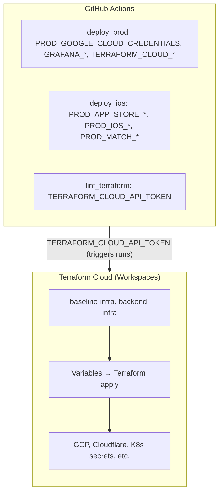

# Required Secrets and Variables

This document describes the required Terraform Cloud variables and GitHub Actions secrets for production deployment. Not all variables apply to every project—omit sections that don't match your stack (e.g., Algolia if no search, RevenueCat if no in-app purchases, MCP if no MCP service).

---

## Terraform Cloud Variables

These variables must be configured in Terraform Cloud for each relevant workspace (e.g., `baseline-infra`, `backend-infra`). Mark all OAuth secrets, API keys, and credentials as **sensitive**.

### Authentication & OAuth2

| Variable                               | Description                                                                              |
|----------------------------------------|------------------------------------------------------------------------------------------|
| `ADMIN_WEBAPP_OAUTH2_CLIENT_ID`        | OAuth2 client ID for the admin webapp. Used for admin user login and session management. |
| `ADMIN_WEBAPP_OAUTH2_CLIENT_SECRET`    | OAuth2 client secret for the admin webapp.                                               |
| `CONSUMER_WEBAPP_OAUTH2_CLIENT_ID`     | OAuth2 client ID for the consumer webapp (root site).                                    |
| `CONSUMER_WEBAPP_OAUTH2_CLIENT_SECRET` | OAuth2 client secret for the consumer webapp.                                            |
| `MCP_SERVICE_OAUTH2_CLIENT_ID`         | OAuth2 client ID for the MCP (Model Context Protocol) service.                           |
| `MCP_SERVICE_OAUTH2_CLIENT_SECRET`     | OAuth2 client secret for the MCP service.                                                |
| `GOOGLE_SSO_OAUTH2_CLIENT_ID`          | Google OAuth2 client ID for "Sign in with Google" (SSO).                                 |
| `GOOGLE_SSO_OAUTH2_CLIENT_SECRET`      | Google OAuth2 client secret for SSO.                                                     |

### Cloud Infrastructure

| Variable                   | Description                                                                                                                         |
|----------------------------|-------------------------------------------------------------------------------------------------------------------------------------|
| `GOOGLE_CLOUD_CREDENTIALS` | GCP service account JSON credentials. Must have permissions for Terraform, GKE, Cloud SQL, Storage, Pub/Sub, and related resources. |
| `CLOUDFLARE_ACCOUNT_ID`    | Cloudflare account ID. Used for Cloudflare API operations at the account level.                                                     |
| `CLOUDFLARE_API_TOKEN`     | Cloudflare API token for DNS and zone management.                                                                                   |
| `CLOUDFLARE_ZONE_ID`       | Cloudflare zone ID for your domain. Used for DNS records (email, database, storage buckets, etc.).                                  |

### Search

*Omit if the project has no search.*

| Variable                 | Description                                               |
|--------------------------|-----------------------------------------------------------|
| `ALGOLIA_APPLICATION_ID` | Algolia application ID for search.                        |
| `ALGOLIA_API_KEY`        | Algolia write API key for indexing and search operations. |

### Push Notifications (iOS)

*Omit if the project has no iOS push notifications.*

| Variable           | Description                                                                                                                  |
|--------------------|------------------------------------------------------------------------------------------------------------------------------|
| `APNS_AUTH_KEY_P8` | Apple Push Notification service (APNs) `.p8` private key content. Used to authenticate with APNs for iOS push notifications. |
| `APNS_KEY_ID`      | APNs key ID (from Apple Developer portal).                                                                                   |

*Note: `APNS_TEAM_ID`, `APNS_BUNDLE_ID`, and `APNS_PRODUCTION` have defaults in Terraform and are typically not required as workspace variables.*

### Email

| Variable           | Description                                                                            |
|--------------------|----------------------------------------------------------------------------------------|
| `SENDGRID_API_KEY` | SendGrid API token for transactional email delivery.                                   |
| `RESEND_API_KEY`   | Resend API key for alternative email delivery (used alongside or instead of SendGrid). |

### Analytics & Feature Flags

| Variable                   | Description                                                                                                                                       |
|----------------------------|---------------------------------------------------------------------------------------------------------------------------------------------------|
| `API_SERVER_SEGMENT_WRITE_KEY` | Segment write key for main analytics (API server, CronJobs, async handler).                                                                        |
| `IOS_APP_SEGMENT_WRITE_KEY`    | Segment write key for iOS proxy source (when iOS app sends events via backend gRPC). Connections → Sources → [Apple source] → Write Key.            |
| `POSTHOG_API_KEY`          | PostHog project API key for event ingestion.                                                                                                      |
| `POSTHOG_PERSONAL_API_KEY` | PostHog personal API key for feature flags API. Create in [PostHog Settings → Personal API Keys](https://app.posthog.com/settings/user-api-keys). |

#### Analytics Proxy (Multi-Source)

The analytics proxy gRPC service forwards client events (e.g. from iOS, web) to analytics providers. Each **source** (`ios`, `web`) has its own config: provider (Segment, Rudderstack, PostHog) and credentials.

- **Environment variables**: Per-source config is fully overridable via env vars. Use `ANALYTICS_PROXY_SOURCES_IOS_*` for iOS and `ANALYTICS_PROXY_SOURCES_WEB_*` for web. Examples:
  - `ANALYTICS_PROXY_SOURCES_IOS_PROVIDER` – Provider for iOS (segment, posthog, rudderstack)
  - `ANALYTICS_PROXY_SOURCES_IOS_SEGMENT_API_TOKEN` – Segment write key for iOS
  - `ANALYTICS_PROXY_SOURCES_IOS_POSTHOG_API_KEY` – PostHog key for iOS
  - `ANALYTICS_PROXY_SOURCES_WEB_PROVIDER`, `ANALYTICS_PROXY_SOURCES_WEB_SEGMENT_API_TOKEN`, etc. – Same pattern for web
- **Per-source secrets**: Add secrets as needed for each source. Example: `segment-ios-write-key` for the `ios` source when using Segment. Store in GCP Secret Manager, add to `SecretProviderClass` and `secret_sync.yaml`, and wire via env var overrides (e.g. `ANALYTICS_PROXY_SOURCES_IOS_SEGMENT_API_TOKEN`).
- **Missing credentials**: If a source has no config or invalid/missing credentials, that source uses a Noop reporter (events are dropped for that source only).

### Observability (Grafana Cloud)

| Variable                            | Description                                                                |
|-------------------------------------|----------------------------------------------------------------------------|
| `GRAFANA_AUTH_TOKEN`                | Grafana Cloud API token for Terraform provider and deployment annotations. |
| `GRAFANA_URL`                       | Grafana Cloud instance URL (e.g., `https://xxx.grafana.net`).              |
| `GRAFANA_CLOUD_PROMETHEUS_USERNAME` | Grafana Cloud Prometheus remote-write username.                            |
| `GRAFANA_CLOUD_PROMETHEUS_PASSWORD` | Grafana Cloud Prometheus remote-write password.                            |
| `GRAFANA_CLOUD_LOKI_USERNAME`       | Grafana Cloud Loki username for log shipping.                              |
| `GRAFANA_CLOUD_LOKI_PASSWORD`       | Grafana Cloud Loki password.                                               |
| `GRAFANA_CLOUD_TEMPO_USERNAME`      | Grafana Cloud Tempo username for distributed tracing.                      |
| `GRAFANA_CLOUD_TEMPO_PASSWORD`      | Grafana Cloud Tempo password.                                              |
| `GRAFANA_CLOUD_PYROSCOPE_USERNAME`  | Grafana Cloud Pyroscope username for continuous profiling.                 |
| `GRAFANA_CLOUD_PYROSCOPE_PASSWORD`  | Grafana Cloud Pyroscope password.                                          |

### Other Services

*Omit if not using RevenueCat.*

| Variable             | Description                                                                                                                                |
|----------------------|--------------------------------------------------------------------------------------------------------------------------------------------|
| `REVENUECAT_API_KEY` | RevenueCat API key for in-app purchases and subscription management. Used by the backend for webhook verification and subscription status. |

---

## GitHub Actions Secrets

These secrets are used by GitHub Actions workflows (e.g., `deploy_prod`, `deploy_ios`, `lint_terraform`). Add them under **Settings → Secrets and variables → Actions**.

### Shared (Multiple Workflows)

| Secret                      | Description                                                                                                             |
|-----------------------------|-------------------------------------------------------------------------------------------------------------------------|
| `TERRAFORM_CLOUD_API_TOKEN` | Terraform Cloud user or team token for the remote backend. Used by `deploy_prod` and `lint_terraform` to run Terraform. |
| `GRAFANA_URL`               | Grafana Cloud instance URL. Used during deploy to create deployment annotations.                                        |
| `GRAFANA_AUTH_TOKEN`        | Grafana Cloud API token for deployment annotations.                                                                     |

### Production Backend Deploy (`deploy_prod`)

| Secret                          | Description                                                                                                                                   |
|---------------------------------|-----------------------------------------------------------------------------------------------------------------------------------------------|
| `PROD_GOOGLE_CLOUD_CREDENTIALS` | GCP service account JSON with permissions for GKE, Cloud SQL, Storage, and deployment operations. Used for `gcloud` auth and Skaffold deploy. |

### iOS Deploy (`deploy_ios`)

*Omit if the project has no iOS app.*

| Secret                               | Description                                                                                                                             |
|--------------------------------------|-----------------------------------------------------------------------------------------------------------------------------------------|
| `PROD_APP_STORE_CONNECT_ISSUER_ID`   | App Store Connect API issuer ID.                                                                                                        |
| `PROD_APP_STORE_CONNECT_KEY_CONTENT` | App Store Connect API key content (`.p8` file contents).                                                                                |
| `PROD_APP_STORE_CONNECT_KEY_ID`      | App Store Connect API key ID.                                                                                                           |
| `PROD_IOS_OAUTH2_CLIENT_ID`          | OAuth2 client ID for the iOS app. Injected into `Secrets.xcconfig` at build time.                                                       |
| `PROD_IOS_OAUTH2_CLIENT_SECRET`      | OAuth2 client secret for the iOS app.                                                                                                   |
| `PROD_IOS_REVENUECAT_API_KEY`        | RevenueCat API key for the iOS app. Used for in-app purchases and subscription tracking.                                                |
| `PROD_MATCH_ENCRYPTION_KEY`          | Fastlane Match encryption password. Used to decrypt the Match git repository containing signing certificates and provisioning profiles. |
| `PROD_MATCH_GIT_BASIC_AUTHORIZATION` | Base64-encoded `user:token` for Git authentication to the Match repository (private repo storing certs/profiles).                       |

*Note: The iOS deploy workflow also uses `PROD_IOS_SEGMENT_WRITE_KEY` for analytics. Add it if not already present.*

---

## Variable Flow Overview

---

## Related Documentation

- `backend/docs/configuration.md` — Backend environment variables and config
- `docs/spin-up-from-scratch.md` — Full setup guide including secrets
