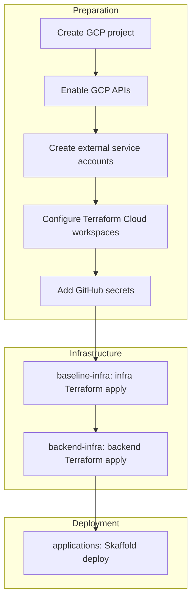

# Spin Up From Scratch

This document enables someone to provision a fresh environment from zero. It is the single source of truth for greenfield setup and can be reused when copying this infrastructure to another project.

---

## 1. Prerequisites and Tooling

### Local tools

Typical prerequisites (see your backend README for project-specific versions):

- [Go](https://golang.org/) 1.26
- [Docker](https://docs.docker.com/get-docker/) and [docker-compose](https://docs.docker.com/compose/install/)
- [wire](https://github.com/google/wire) for dependency management
- [make](https://www.gnu.org/software/make/) for task running
- [sqlc](https://sqlc.dev/) for generating database code
- [gci](https://www.github.com/daixiang0/gci) for sorting imports
- [tagalign](https://www.github.com/4meepo/tagalign) for aligning struct tags
- [terraform](https://learn.hashicorp.com/tutorials/terraform/install-cli) for deploying/formatting
- [cloud_sql_proxy](https://cloud.google.com/sql/docs/postgres/sql-proxy) for production database access
- [fieldalignment](https://pkg.go.dev/golang.org/x/tools/go/analysis/passes/fieldalignment) (optional, for struct optimization)

### Accounts

- **GCP** — Google Cloud Platform project
- **Terraform Cloud** — organization and workspaces
- **GitHub** — repository and Actions secrets
- **External services** — all accounts listed in [External Services](#3-external-services) below

---

## 2. GCP Project Setup

### Create a GCP project

1. Create a new project in [Google Cloud Console](https://console.cloud.google.com/) or via `gcloud projects create`.
2. Set the project ID (e.g. `my-project-prod`).
3. Create a service account for GitHub Actions with sufficient permissions (e.g. `roles/owner` or equivalent for Terraform + GKE + Cloud SQL + Storage + Pub/Sub).

### Enable GCP APIs

For a new project, enable the following APIs. Terraform explicitly enables `secretmanager.googleapis.com` and `servicenetworking.googleapis.com`; the rest are typically required by the resources they create.

**Core APIs** (directly used by Terraform):

```bash
gcloud services enable \
  secretmanager.googleapis.com \
  servicenetworking.googleapis.com \
  compute.googleapis.com \
  container.googleapis.com \
  sqladmin.googleapis.com \
  pubsub.googleapis.com \
  storage.googleapis.com \
  artifactregistry.googleapis.com \
  iam.googleapis.com \
  fcm.googleapis.com \
  firebase.googleapis.com \
  --project=YOUR_PROJECT_ID
```

**Supporting APIs** (often auto-enabled as dependencies):

```bash
gcloud services enable \
  cloudapis.googleapis.com \
  cloudresourcemanager.googleapis.com \
  serviceusage.googleapis.com \
  servicemanagement.googleapis.com \
  cloudtrace.googleapis.com \
  logging.googleapis.com \
  monitoring.googleapis.com \
  iamcredentials.googleapis.com \
  storage-api.googleapis.com \
  storage-component.googleapis.com \
  sql-component.googleapis.com \
  dns.googleapis.com \
  networkconnectivity.googleapis.com \
  --project=YOUR_PROJECT_ID
```

### Domain ownership

Cloudflare, SendGrid domain auth, and Caddy (Let's Encrypt) all assume you control your domain. Ensure:

- The domain is added to Cloudflare
- DNS is managed by Cloudflare (or the zone ID is available)

---

## 3. External Services

Each service requires sign-up, credentials, and (where applicable) Terraform Cloud variables.

| Service           | Purpose                                 | Key Credentials                     | Terraform Variable                                                                                                                            |
|-------------------|-----------------------------------------|-------------------------------------|-----------------------------------------------------------------------------------------------------------------------------------------------|
| **Algolia**       | Text search                             | App ID, Write API Key               | `ALGOLIA_APPLICATION_ID`, `ALGOLIA_API_KEY`                                                                                                   |
| **Grafana Cloud** | Observability (Prometheus, Loki, Tempo) | Username/password per stack         | `GRAFANA_CLOUD_PROMETHEUS_USERNAME`, `GRAFANA_CLOUD_PROMETHEUS_PASSWORD`, `GRAFANA_CLOUD_LOKI_*`, `GRAFANA_CLOUD_TEMPO_*`                     |
| **Resend**        | Email (prod)                            | API key                             | `RESEND_API_KEY`                                                                                                                              |
| **SendGrid**      | Email (domain auth, infra Terraform)    | API key                             | `SENDGRID_API_KEY`                                                                                                                            |
| **Segment**       | Analytics (backend events)              | API server + iOS write keys         | `API_SERVER_SEGMENT_WRITE_KEY`, `IOS_APP_SEGMENT_WRITE_KEY`                                                                                   |
| **PostHog**       | Analytics + feature flags               | Project + Personal API keys         | `POSTHOG_API_KEY`, `POSTHOG_PERSONAL_API_KEY`                                                                                                 |
| **Stripe**        | Web payments                            | API key, webhook secret             | (in app config, not Terraform vars)                                                                                                           |
| **RevenueCat**    | Mobile IAP                              | API key, webhook auth               | (iOS build secrets)                                                                                                                           |
| **Cloudflare**    | DNS, domain verification                | API token, Zone ID                  | `CLOUDFLARE_API_TOKEN`, `CLOUDFLARE_ZONE_ID`                                                                                                  |
| **APNs**          | iOS push notifications                  | .p8 key, Key ID, Team ID, Bundle ID | `APNS_KEY_ID`, `APNS_AUTH_KEY_P8`, `APNS_TEAM_ID`, `APNS_BUNDLE_ID`, `APNS_PRODUCTION`                                                        |
| **Firebase**      | Android push (FCM)                      | Via GCP Workload Identity           | (no extra secrets)                                                                                                                            |
| **Google OAuth**  | SSO, webapp OAuth clients               | Client ID/Secret per client         | `GOOGLE_SSO_OAUTH2_CLIENT_ID`, `GOOGLE_SSO_OAUTH2_CLIENT_SECRET`, `ADMIN_WEBAPP_OAUTH2_*`, `CONSUMER_WEBAPP_OAUTH2_*`, `MCP_SERVICE_OAUTH2_*` |

### Per-service details

| Service           | Sign-up / creation                                                                                                      | Notes                                                                                                                                                                                                                            |
|-------------------|-------------------------------------------------------------------------------------------------------------------------|----------------------------------------------------------------------------------------------------------------------------------------------------------------------------------------------------------------------------------|
| **Algolia**       | [algolia.com](https://www.algolia.com/) — create app, get Application ID and Admin API Key                              | Create indices via Terraform or manually; index names depend on your application                                                                                                                                                 |
| **Grafana Cloud** | [grafana.com/products/cloud](https://grafana.com/products/cloud/) — create stack, get Prometheus/Loki/Tempo credentials | Username/password per stack; also need `GRAFANA_AUTH_TOKEN` and `GRAFANA_URL` for Terraform Grafana provider                                                                                                                     |
| **Resend**        | [resend.com](https://resend.com/) — create account, verify domain, get API key                                          | Used for prod email. **Domain verification is manual**: add your domain in the Resend dashboard, then add the MX, SPF, and DKIM records to your DNS (e.g. Cloudflare). There is no Terraform integration for Resend domain auth. |
| **SendGrid**      | [sendgrid.com](https://sendgrid.com/) — create account, verify domain, get API key                                      | Used for domain auth in infra Terraform; DNS records created by Terraform                                                                                                                                                        |
| **Segment**       | [segment.com](https://segment.com/) — create workspace, get API token                                                   | Backend event analytics                                                                                                                                                                                                          |
| **PostHog**       | [posthog.com](https://posthog.com/) — create project, get Project API Key; create Personal API Key in Settings          | Used for events and feature flags                                                                                                                                                                                                |
| **Stripe**        | [stripe.com](https://stripe.com/) — create account, get API keys, configure webhook                                     | Stored in app config; not Terraform vars                                                                                                                                                                                         |
| **RevenueCat**    | [revenuecat.com](https://www.revenuecat.com/) — create project, get API key                                             | iOS build secrets                                                                                                                                                                                                                |
| **Cloudflare**    | [cloudflare.com](https://www.cloudflare.com/) — add domain, zone, create API token with Zone:DNS permissions            | Need Zone ID from dashboard                                                                                                                                                                                                      |
| **APNs**          | Apple Developer — create .p8 key in Certificates, Identifiers & Profiles                                                | `APNS_PRODUCTION=false` for sandbox/TestFlight; `true` for App Store                                                                                                                                                             |
| **Firebase**      | [console.firebase.google.com](https://console.firebase.google.com/) — add project, enable FCM                           | Workload Identity uses GCP project; no extra secrets                                                                                                                                                                             |
| **Google OAuth**  | [Google Cloud Console](https://console.cloud.google.com/) → APIs & Services → Credentials — create OAuth 2.0 Client IDs | One for SSO; one each for Admin webapp, Consumer webapp, MCP server                                                                                                                                                              |

### Optional / alternative services

- **Rudderstack** — alternative to Segment
- **SendGrid vs Resend** — both supported; configure via env/config
- **Elasticsearch** — alternative to Algolia for text search
- **Pinecone / Qdrant** — vector search (optional)

---

## 4. Terraform Cloud Setup

### Organization and workspaces

- **Organization**: Your Terraform Cloud organization (configure in `_terraform_.tf`)
- **Workspaces**:
  - `prod-infra` — GKE cluster, networking, SendGrid, Cloudflare, Caddy
  - `prod-backend` — Cloud SQL, Pub/Sub, storage, Algolia indices, K8s secrets

### Variables

Add all variables to Terraform Cloud. Sources: `secrets.tf`, `meta_variables.tf`, and provider configs (Algolia, Cloudflare, Grafana, SendGrid, Google).

**Backend workspace (`prod-backend`) variables**:

| Variable                               | Description                          |
|----------------------------------------|--------------------------------------|
| `GOOGLE_CLOUD_CREDENTIALS`             | GCP service account JSON             |
| `GOOGLE_SSO_OAUTH2_CLIENT_ID`          | Google OAuth2 client ID              |
| `GOOGLE_SSO_OAUTH2_CLIENT_SECRET`      | Google OAuth2 client secret          |
| `ADMIN_WEBAPP_OAUTH2_CLIENT_ID`        | Admin OAuth2 client ID               |
| `ADMIN_WEBAPP_OAUTH2_CLIENT_SECRET`    | Admin OAuth2 client secret           |
| `CONSUMER_WEBAPP_OAUTH2_CLIENT_ID`     | Consumer webapp OAuth2 client ID     |
| `CONSUMER_WEBAPP_OAUTH2_CLIENT_SECRET` | Consumer webapp OAuth2 client secret |
| `MCP_SERVICE_OAUTH2_CLIENT_ID`         | MCP server OAuth2 client ID          |
| `MCP_SERVICE_OAUTH2_CLIENT_SECRET`     | MCP server OAuth2 client secret      |
| `SENDGRID_API_KEY`                     | SendGrid API token                   |
| `RESEND_API_KEY`                       | Resend API key                       |
| `API_SERVER_SEGMENT_WRITE_KEY`         | Segment write key (main analytics)   |
| `IOS_APP_SEGMENT_WRITE_KEY`            | Segment write key (iOS proxy source) |
| `POSTHOG_API_KEY`                      | PostHog Project API Key              |
| `POSTHOG_PERSONAL_API_KEY`             | PostHog Personal API Key             |
| `ALGOLIA_APPLICATION_ID`               | Algolia app ID                       |
| `ALGOLIA_API_KEY`                      | Algolia write API key                |
| `GRAFANA_CLOUD_PROMETHEUS_USERNAME`    | Grafana Cloud Prometheus username    |
| `GRAFANA_CLOUD_PROMETHEUS_PASSWORD`    | Grafana Cloud Prometheus password    |
| `GRAFANA_CLOUD_LOKI_USERNAME`          | Grafana Cloud Loki username          |
| `GRAFANA_CLOUD_LOKI_PASSWORD`          | Grafana Cloud Loki password          |
| `GRAFANA_CLOUD_TEMPO_USERNAME`         | Grafana Cloud Tempo username         |
| `GRAFANA_CLOUD_TEMPO_PASSWORD`         | Grafana Cloud Tempo password         |
| `GRAFANA_AUTH_TOKEN`                   | Grafana provider auth token          |
| `GRAFANA_URL`                          | Grafana provider URL                 |
| `APNS_KEY_ID`                          | APNs key ID                          |
| `APNS_AUTH_KEY_P8`                     | APNs .p8 key content (sensitive)     |
| `APNS_TEAM_ID`                         | APNs team ID                         |
| `APNS_BUNDLE_ID`                       | APNs bundle ID                       |
| `APNS_PRODUCTION`                      | `true` or `false`                    |
| `CLOUDFLARE_API_TOKEN`                 | Cloudflare API token                 |
| `CLOUDFLARE_ZONE_ID`                   | Cloudflare Zone ID                   |

**Infra workspace (`prod-infra`)** variables: `GOOGLE_CLOUD_CREDENTIALS`, `SENDGRID_API_KEY`, `CLOUDFLARE_API_TOKEN`, `CLOUDFLARE_ZONE_ID` (and any others used by infra Terraform).

### Sensitive variables

Mark as sensitive in Terraform Cloud: `APNS_AUTH_KEY_P8`, all OAuth secrets, all API keys.

---

## 5. GitHub Secrets (for deploy workflow)

From your deploy workflow (e.g. `.github/workflows/deploy_prod.yaml`):

| Secret                                                          | Description                                                                                          |
|-----------------------------------------------------------------|------------------------------------------------------------------------------------------------------|
| `GOOGLE_CLOUD_CREDENTIALS` (or `PROD_GOOGLE_CLOUD_CREDENTIALS`) | GCP service account JSON with sufficient permissions for Terraform, GKE, Cloud SQL, Storage, Pub/Sub |
| `TERRAFORM_CLOUD_API_TOKEN`                                     | Terraform Cloud user or team token for remote backend                                                |

---

## 6. Deployment Order



1. **Create GCP project** — enable APIs, create service account for GitHub Actions
2. **Sign up and configure external services** — collect all credentials
3. **Create Terraform Cloud org + workspaces** — add all variables
4. **Add GitHub secrets** — GCP credentials and `TERRAFORM_CLOUD_API_TOKEN`
5. **Push to `prod`** (or run workflow manually) — triggers:
   - `baseline-infra` — infra Terraform apply
   - `backend-infra` — backend Terraform apply
   - `applications` — Skaffold deploy (API server, workers, cronjobs)

See your deployment doc for branch strategy and deploy workflow details.

---

## 7. Post-Provisioning

- **Database migrations**: Run automatically by API server on startup when `runMigrations: true` in config; successful health check implies they ran.
- **Bootstrap data**: Local dev typically seeds data at startup; prod may use a search index initializer or similar tool to populate Algolia from the DB.
- **Algolia indices**: Created by Terraform; populated by search index scheduler or initializer.
- **Verification**: Run your post-deployment checklist after each deploy.

---

## 8. Local Development (minimal)

- Run `make dev` — uses docker-compose (Postgres, Redis, Jaeger, Prometheus, Loki, Grafana, OTEL collector)
- No GCP or external prod services required for basic local dev
- Reference your backend README and configuration docs

---

## Related

- Deployment doc — branch strategy, deploy workflow
- Post-deployment checklist — verification steps
- Configuration docs — config and env vars
