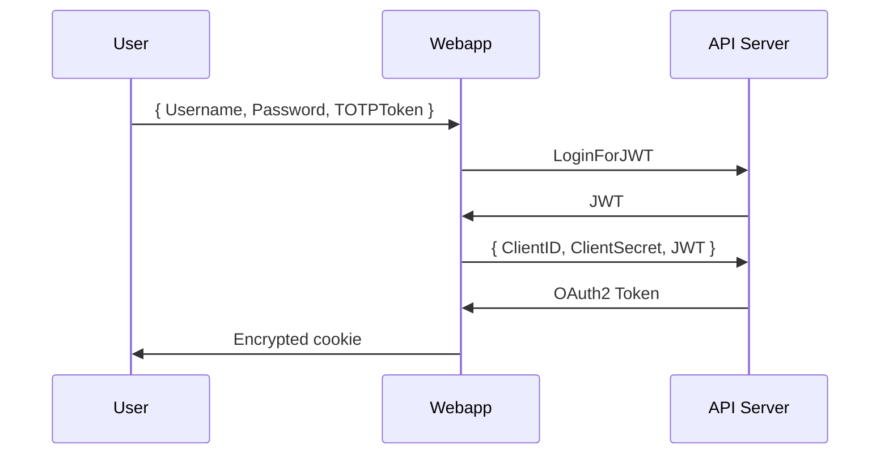
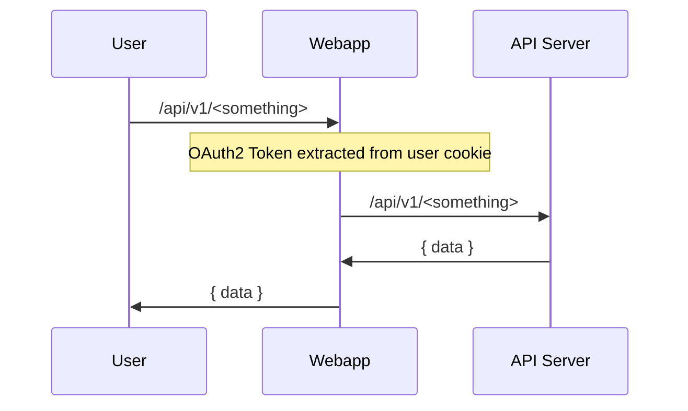

# Authentication

Here's how authentication between the frontend webapps (both admin and app) and the API server works:

```mermaid
sequenceDiagram
    User->>Webapp: { Username, Password, TOTPToken }
    Webapp->>API Server: LoginForJWT
    API Server->>Webapp: JWT
    Webapp->>API Server: { ClientID, ClientSecret, JWT }
    API Server->>Webapp: OAuth2 Token
    Webapp->>User: Encrypted cookie
```

Here's how subsequent calls to the API are proxied and authenticated:

```mermaid
sequenceDiagram
    User->>Webapp: /api/v1/<something>
    note over Webapp: OAuth2 Token extracted from user cookie
    Webapp->>API Server: /api/v1/<something>
    API Server->>Webapp: { data }
    Webapp->>User: { data }
```
