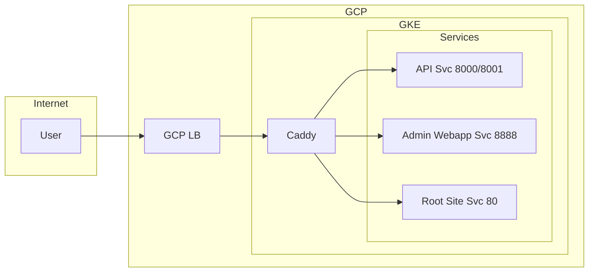

# Caddy Replace cert-manager Plan

## Executive Summary

Replace cert-manager with Caddy for TLS certificate management. Caddy will sit in front of backend services, obtain and renew Let's Encrypt certs automatically, and reverse-proxy traffic. The existing GCE Ingress and GCP Load Balancer stay in place—Caddy is inserted between the LB and the services.

---

## Current Architecture

```mermaid
flowchart LR
    subgraph Internet
        User[User]
    end
    subgraph GCP
        LB[GCP HTTP(S) LB]
        subgraph GKE
            Ingress[GCE Ingress]
            API[API Svc 8000/8001]
            Admin[Admin Webapp Svc 8888]
            Root[Root Site Svc 80]
        end
    end
    subgraph cert-manager
        LE[Let's Encrypt]
        SS[SelfSigned]
    end
    User --> LB
    LB --> Ingress
    Ingress --> API
    Ingress --> Admin
    Ingress --> Root
    LE --> Ingress
    SS --> API
```

**Current components:**

- **GCE Ingress** ([infra/deploy/environments/prod/kustomize/ingress.yaml](infra/deploy/environments/prod/kustomize/ingress.yaml)) - Creates GCP LB, routes 5 hosts
- **cert-manager** - Let's Encrypt (DNS-01 via Cloudflare) for edge TLS; self-signed for gRPC backend TLS (GCE LB HTTP/2 requires TLS)
- **BackendConfig** - Custom health checks for gRPC port (8001) via HTTP port (8000)

**Host-to-service mapping:**

| Host                                                                              | Service                             | Port        |
| --------------------------------------------------------------------------------- | ----------------------------------- | ----------- |
| api.dinnerdonebetter.com                                                          | dinner-done-better-api-svc          | 8001 (gRPC) |
| http-api.dinnerdonebetter.com                                                     | dinner-done-better-api-svc          | 8000 (HTTP) |
| admin.dinnerdonebetter.com                                                        | dinner-done-better-admin-webapp-svc | 8888        |
| dinnerdonebetter.com, [www.dinnerdonebetter.com](http://www.dinnerdonebetter.com) | dinner-done-better-root-site-svc    | 80          |

---

## Target Architecture



**Key change:** Caddy replaces GCE Ingress as the edge. Caddy is exposed via LoadBalancer Service (GCP LB remains). Caddy terminates TLS (obtains certs from Let's Encrypt), reverse-proxies to backend services over HTTP, and cert-manager is removed.

---

## Benefits

| Benefit                 | Details                                                             |
| ----------------------- | ------------------------------------------------------------------- |
| **Remove cert-manager** | No more Certificate, Issuer, or grpc-backend-tls resources          |
| **Automatic TLS**       | Caddy obtains and renews Let's Encrypt certs natively               |
| **Simpler stack**       | Fewer CRDs and controllers to operate                               |
| **No backend TLS**      | Caddy talks HTTP/h2c to backends; grpc-backend-tls no longer needed |

---

## Trade-offs and Considerations

1. **GCE Ingress replaced** - Caddy + LoadBalancer Service replaces GCE Ingress. The LoadBalancer Service creates a GCP LB; External DNS can annotate it for hostname sync.
2. **ACME challenge** - Caddy needs HTTP-01 or DNS-01 to obtain certs. DNS-01 requires the caddy-dns/cloudflare plugin and `CLOUDFLARE_API_TOKEN` (already in `cloudflare-api-key` secret).
3. **Caddy image** - The default Caddy image does not include the Cloudflare DNS plugin. Use `xcaddy` to build a custom image, or a community image that includes it.
4. **External DNS** - Currently uses `--source=ingress`. Add `--source=service` (or switch to service-only) so External DNS creates DNS records for the Caddy LoadBalancer Service.

---

## Implementation Plan

### Phase 1: Add Caddy (parallel to existing)

1. **Create Caddy Deployment**

- Deploy Caddy in `prod` namespace
- Mount Caddyfile from ConfigMap
- For DNS-01 ACME: use Caddy image with caddy-dns/cloudflare plugin, or run `xcaddy build` with the plugin
- Env: `CLOUDFLARE_API_TOKEN` from `cloudflare-api-key` secret

1. **Create Caddyfile ConfigMap**

- Reverse proxy rules for all 5 hosts (see draft below)
- Global options: `acme_dns cloudflare {env.CLOUDFLARE_API_TOKEN}` for DNS-01
-

1. **Create Caddy Service**

- LoadBalancer type; annotate with `external-dns.alpha.kubernetes.io/hostname` for the 5 hosts so External DNS syncs the LB IP to Cloudflare

### Phase 2: Validate and cutover

1. **Test**

- Deploy Caddy alongside existing stack
- Point a test hostname (e.g., `staging.dinnerdonebetter.com`) to Caddy
- Verify TLS issuance, HTTP, HTTPS, gRPC

1. **Cutover**

- Remove GCE Ingress; DNS will point to Caddy's LoadBalancer (via External DNS)
- Monitor cert renewal and routing

### Phase 3: Remove cert-manager

1. **Remove cert-manager resources**

- Delete [infra/deploy/environments/prod/kustomize/cert_issuer.yaml](infra/deploy/environments/prod/kustomize/cert_issuer.yaml)
- Delete [infra/deploy/environments/prod/kustomize/certificate.yaml](infra/deploy/environments/prod/kustomize/certificate.yaml)
- Delete [infra/deploy/environments/prod/kustomize/grpc_backend_cert.yaml](infra/deploy/environments/prod/kustomize/grpc_backend_cert.yaml)
- Remove from [infra/deploy/environments/prod/kustomize/kustomization.yaml](infra/deploy/environments/prod/kustomize/kustomization.yaml)

1. **Remove cert-manager install**

- Remove from [.github/workflows/deploy_prod.yaml](.github/workflows/deploy_prod.yaml) (line 160): `kubectl apply -f ... cert-manager.yaml`

1. **Remove GCE-specific backend TLS**

- Remove [backend/deploy/environments/prod/kustomize/patches/deployment-grpc-tls.yaml](backend/deploy/environments/prod/kustomize/patches/deployment-grpc-tls.yaml)
- Remove [backend/deploy/environments/prod/kustomize/patches/service-api-backendconfig.yaml](backend/deploy/environments/prod/kustomize/patches/service-api-backendconfig.yaml)
- Update API server to serve gRPC over plain HTTP/2 (no TLS) when receiving from Caddy

1. **Remove GCE Ingress**

- Delete [infra/deploy/environments/prod/kustomize/ingress.yaml](infra/deploy/environments/prod/kustomize/ingress.yaml)
- Remove from kustomization.yaml; External DNS will use the Caddy Service annotations

1. **Update documentation**

- [docs/post-deployment-checklist.md](docs/post-deployment-checklist.md) - Replace cert-manager checks with Caddy checks
  - [docs/deployment.md](docs/deployment.md) - Update architecture

---

## Caddyfile (Draft)

```caddyfile
{
    acme_dns cloudflare {env.CLOUDFLARE_API_TOKEN}
}

api.dinnerdonebetter.com {
    reverse_proxy dinner-done-better-api-svc.prod.svc.cluster.local:8001 {
        transport http {
            versions h2c 2
        }
    }
}

http-api.dinnerdonebetter.com {
    reverse_proxy dinner-done-better-api-svc.prod.svc.cluster.local:8000
}

admin.dinnerdonebetter.com {
    reverse_proxy dinner-done-better-admin-webapp-svc.prod.svc.cluster.local:8888
}

dinnerdonebetter.com, www.dinnerdonebetter.com {
    reverse_proxy dinner-done-better-root-site-svc.prod.svc.cluster.local:80
}
```

**Note:** The `acme_dns cloudflare` directive requires the [caddy-dns/cloudflare](https://github.com/caddy-dns/cloudflare) plugin. Use `caddy:builder` or `xcaddy` to build a custom image, or use a community image that includes it.

---

## Rollback Plan

- Keep cert-manager manifests in a branch
- If cutover fails: revert Ingress/Service to point to original backends, re-apply cert-manager
- cert-manager will re-issue certs via DNS-01

---

## Files to Create

- `infra/deploy/environments/prod/kustomize/caddy_deployment.yaml`
- `infra/deploy/environments/prod/kustomize/caddy_configmap.yaml`
- `infra/deploy/environments/prod/kustomize/caddy_service.yaml`

## Files to Modify

- [infra/deploy/environments/prod/kustomize/kustomization.yaml](infra/deploy/environments/prod/kustomize/kustomization.yaml) - Add Caddy resources; remove ingress, cert-manager resources
- [infra/deploy/environments/prod/kustomize/external_dns.yaml](infra/deploy/environments/prod/kustomize/external_dns.yaml) - Add `--source=service` so External DNS syncs Caddy LoadBalancer Service
- [backend/deploy/environments/prod/kustomize/kustomization.yaml](backend/deploy/environments/prod/kustomize/kustomization.yaml) - Remove BackendConfig patch, deployment-grpc-tls patch
- [.github/workflows/deploy_prod.yaml](.github/workflows/deploy_prod.yaml) - Remove cert-manager install
- API server - Config to disable gRPC TLS when behind Caddy

## Files to Delete

- [infra/deploy/environments/prod/kustomize/ingress.yaml](infra/deploy/environments/prod/kustomize/ingress.yaml)
- [infra/deploy/environments/prod/kustomize/cert_issuer.yaml](infra/deploy/environments/prod/kustomize/cert_issuer.yaml)
- [infra/deploy/environments/prod/kustomize/certificate.yaml](infra/deploy/environments/prod/kustomize/certificate.yaml)
- [infra/deploy/environments/prod/kustomize/grpc_backend_cert.yaml](infra/deploy/environments/prod/kustomize/grpc_backend_cert.yaml)
- [backend/deploy/environments/prod/kustomize/patches/service-api-backendconfig.yaml](backend/deploy/environments/prod/kustomize/patches/service-api-backendconfig.yaml)
- [backend/deploy/environments/prod/kustomize/patches/deployment-grpc-tls.yaml](backend/deploy/environments/prod/kustomize/patches/deployment-grpc-tls.yaml)

---

## Prerequisites

- Cloudflare API token (already in `cloudflare-api-key` secret)
- Caddy image with cloudflare DNS plugin, or use HTTP-01 if Caddy is reachable on port 80 for ACME challenge
